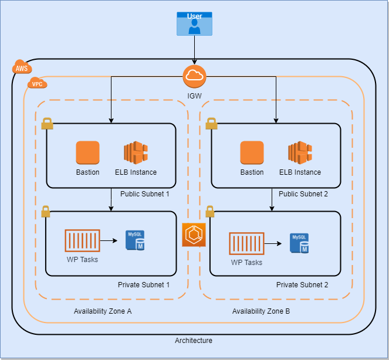

[](https://www.bridgecrew.cloud/link/badge?vcs=github&fullRepo=bhoslepu%2Ftfecs&benchmark=INFRASTRUCTURE+SECURITY)

# tfecs
This repository code can be used to deploy containerized WordPress application on to AWS ECS with database on RDS MySQL.

## Key features:
* Creates a VPC with public & private subnet along with IGW & NGW for internet access, different security groups for each layers (ELB, EC2 & RDS)
* Creates Bastion & ELB instances in public subnet
* Bastion host for SSH from outside and internal instances are allowed from Bastion only
* ECS service tasks will receive traffic from ELB
* ECS EC2 and RDS instances are created in private subnets
* MySQL RDS will only be accessible from Bastion & ECS EC2 instances
* ECS containers logs onto CloudWatch logs

## Architecture_Diagram


## How to use
* Install Terraform (0.12 or newer)
* Clone repository code
```
git clone https://github.com/bhoslepu/tfecs
cd tfecs
```
* Copy terraform.tfvars.example to terraform.tfvars
* Update values in terraform.tfvars
* Run terraform commands
```
terraform init
terraform plan
terraform apply
```

## Requirements

| Name | Version |
|------|---------|
| terraform | >= 0.12 |

## Modules

| Name | Source | Version |
|------|--------|---------|
| compute | ./modules/compute |  |
| ecs | ./modules/ecs |  |
| iam | ./modules/iam |  |
| network | ./modules/network |  |
| rds | ./modules/rds |  |

## Inputs

| Name | Description | Type | Default | Required |
|------|-------------|------|---------|:--------:|
| vpc\_name | VPC Name | `string` | `"ecsdemo"` | yes |
| ecs\_cluster\_name | ECS cluster name | `string` | `"wpcluster"` | no |
| region-key | pem key for connecting instances | `string` | `"devops"` | yes |
| desired\_capacity | ECS ASG instnace desired capacity | `string` | `"1"` | no |
| max\_instance\_size | ECS ASG instnace max capacity | `string` | `"3"` | no |
| min\_instance\_size | ECS ASG instnace min capacity | `string` | `"1"` | no |

## Outputs

No output.


# Securing infrastructure and alerting:
* ELB is configured with HTTP, but it should be only on HTTPS. In code, there is provision for configuring HTTPS on ELB and redirection of HTTP to HTTPS. SSL certificate will require for this, AWS ACM certificate could be simple, secure and easy option to validate certificates
* Currently password for RDS is in plain text. This should be encrypted or retrieved any secret manager. AWS parameter group or secret manager can be used for this. AWS secret manager provides functionality of auto-rotation of passwords
* Encryption of RDS instances disks and separate subnets
* Only a group (of required users) should have access to ECS/RDS services through IAM
* Providing instances access to users through SSH key manager tools, example - userify
* Configure Security Groups to allow only trusted networks. Don’t open access to any port for 0.0.0.0/0 for AWS resources
* Enable AWS Cloudtrails logging for management, API and console access. Filter the logs and set up alerts for common actions like unusual login attempts, access to unauthorized AWS  resources.

# Wordpress Security, performance and Backup
## Latest/Updated versions:
To protect from vulnerabilities that present in the last version keep updated everything.
* Keep WordPress core version, plugins and theme updated. 
* Do not install untrusted plugins and themes.
* Securing backdoors like wp-Admin, FTP, etc. If possible, use SFTP as this is more secure than normal FTP.

## Restricting login/Access:
Below configuration will help in preventing unwanted access and brute-force login attempts
* Change wp-admin URL to something else
* Configure 2-Factor authentication 
* Limit the login attempts to low numbers
* Restrict access only from trusted IPs like office public IP or AWS EC2 instance which only will access wp-admin dashboard

## Hardening:
Apply some hardening with the help of web-server configurations
* Secure your wp-config.php file
* Make use of .htaccess to redirect urls
* Block PHP execution in untrusted folders
* Prevent PHP Execution

## Firewall and Scanning:
* WAF will help in defending with Brute-force Attempts by restricting access to website from malicious IPs or country/region
* Configure automated vulnerability scanning on website for regular check-up

## CDN for static content:
* Configure AWS CloudFront for caching static content. This will help in loading website faster and improve performance.

## Backup:
* Configure automated backups for website and database. This will be helpful disaster recovery, data loss due to infrastructure issues or deleted due to mis-configurations

